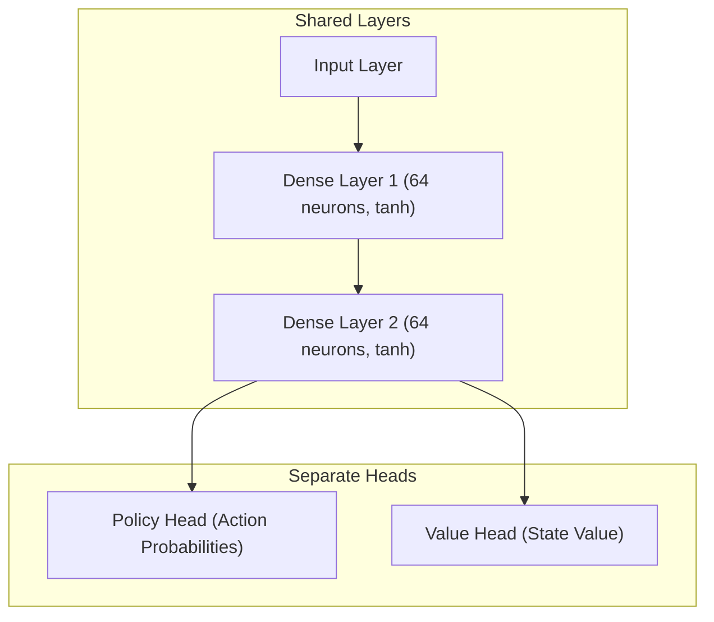
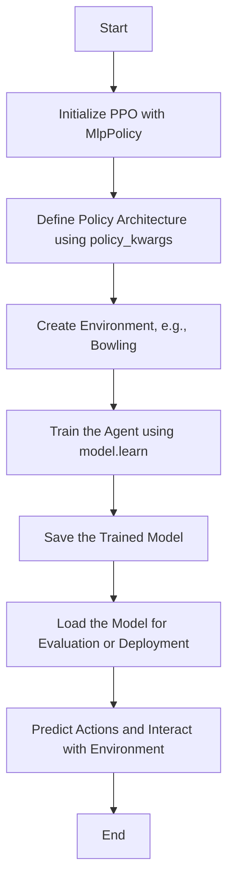

# RL-Games
Getting into Reinforcement Learning

# mlpPolicy:

## Using PPO (Proximal Policy Optimization)

Actor-critic architecture:
1. Policy Network (Actor): Responsible for selecting actions based on the current state.
2. Value Network (Critic): Estimates the value function to provide feedback on how good the state is under the current policy.

## MlpPolicy architecture:

### RL flowchart:

